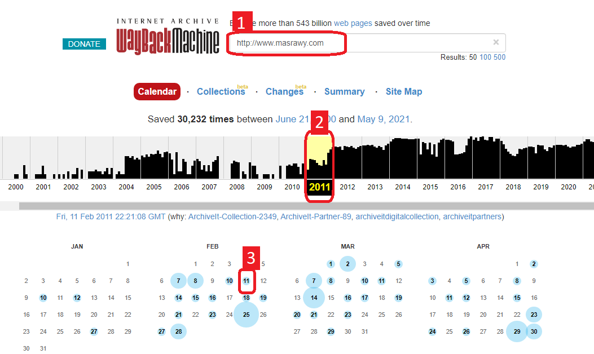
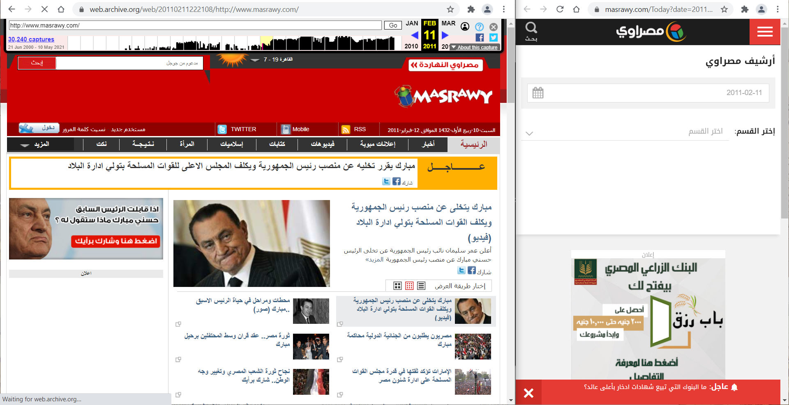
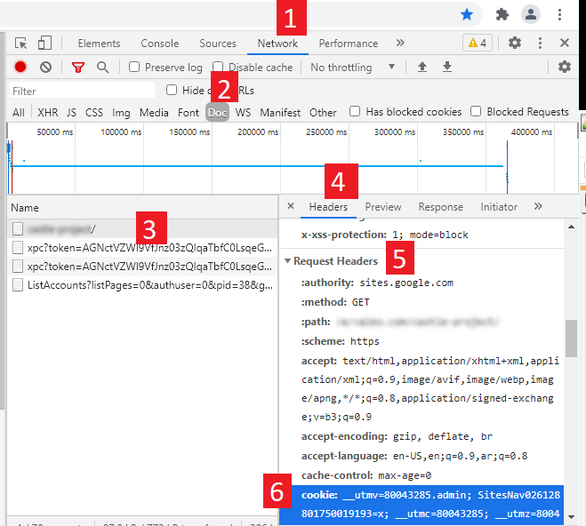

من العادي ان يحتاج القارئ أو الباحث ان يقول بطباعة او حفظ صفحة من الانترنت. يمكن ذلك بسهولة من اي متصفح عن طريق ضغط `Ctrl+S` او طباعة الصفحة باستخدام `Ctrl+P`. أما في حالة الحاجة لتنزليل موقع كامل .. منتدى مثلا .. بكل صفحاته وبكل المرفقات والتعليقات ..الخ .. فتلك قصة اخرى!

## هل فعلا تحتاج الى تنزيل موقع بالكامل؟

البعض عنده هواجس من [رواية 1984 لجورج اورويل](https://www.goodreads.com/book/show/8892550-1984-1) وكيفية تزوير التاريخ، فيحب أن يكون عنده أرشيف شخصي من مواقع الاخبار، منتديات سياسية، صفحات فيسبوك، حتى اذا عبث بها العابثون فيكون عنده نسخة أصلية للموقع. وقد كان الواعون من ابناء جيلي شهودا على مثل هذا العبث، الكثير من المواقع الاخبارية العربية قامت بالفعل بحذف محتويات تدين الانظمة اللاحقة، فتم العبث بذاكرة الشعوب المغيبة للاسف. 
حدث ولا حرج عن فترة الثورة وانتهاكات الحكومة، لن تجد اخبار مشينة في موقع مصراوي ولا المصري اليوم .. الخ .. بعد ان تم تغيير النهج الصحفي لاحقا. 

## أرشيف الانترنت

بدأ [هذا المشروع](https://ar.wikipedia.org/wiki/%D8%A3%D8%B1%D8%B4%D9%8A%D9%81_%D8%A7%D9%84%D8%A5%D9%86%D8%AA%D8%B1%D9%86%D8%AA) العملاق في 1996 للحفاظ على التراث البشري بشكل عام. ويمكنك من خلاله تصفح موقع ما في زمن ما، فيمكنك مثلا مشاهدة عناوين الاخبار في اي تاريخ يعجبك وهكذا. يقوم الارشيف بحل جزء كبير من مشكلة العبثين بالتاريخ والذاكرة، ولكن على المستوى التقني، ففيه عدة مشاكل.

في البداية، ادخل على [https://web.archive.org](https://web.archive.org) ثم اتبع الخطوات كما بالصورة



بمجرد أنك قمت باختيار نقطة في الزمن، سيظهر لك الموقع كما كان في هذا الوقت، حتى صاحب الموقع لا يستطيع التلاعب به! قارن ارشيف موقع مصراوي حاليا مع النسخة المحفوظة من مشروع الأرشيف: للاسف مصراوي قد أزال المحتوى من عنده، لكنه موجود في الارشيف.



رغم ميزات الارشيف الرائعة، الا انه لا يحفظ جميع المواقع .. يحفظ المشهور منها فقط. كما ان به عدة مشاكل بسيطة في بعض الصور لو كانت مخدومة من خامد اخر.

## برنامج مجاني للأرشيف

لعمل أرشيف شخصي، يمكنك اسخدام برنامج [HTTrack](https://www.httrack.com/) المتاح بشكل مجاني. فهو سهل الاستخدام ومناسف لتنزيل عدة مواقع مرة واحدة. يوجد أيضا برامج مشابهة ولكنى أجده الافضل بين البرامج المتاحة، وان كانت الفوارق بسيطة.

### مشكلة صفحات الدخول

لفهم تلك المشكلة، يجب ان نفهم كيف يعمل الارشيف. فهو يقوم مقام المتصفح:
 * يتصل بالخادم الخاص بالموقع
 * يقول للخادم أعطني الصفحة
 * لا يقوم بعرض الصفحة مثل المتصفح، بل بحفظها وحفظ الصور على جهازك
 * اذا وجد رابط (للخبر التالي، للتعليقات، للمرفقات) يقوم بعمل الخطوات 1-3 من جديد
 
وهكذا يتم تنزيل جميع صفحات الموقع، التي بالضرورة بيها روابط.
إذا كان الموقع يحتاج دخول المستخد لعض محتوى معين له، مثلما يحدث في مواقع التواصل الاجتماعي، `Google Sites`، أو أي موقع للمشتركين فقط، فعندها طريقة الأرشيف لن تفلح. فالخادم ببساطة لن يعرف من هو المستخدم، وسيقوم بالتحويل على صفحة الدخول. لن يستطيع برنامج الارشيف ان يقوم بتنزل اي صفحة سوى صفحة الدخول. هي وحدها المتاحة للعامة.

## حل مشكلة الدخول

للاتفاف حول عائق صفحة الدخول، يجب على برنامج الأرشيف بيان شخصية المستخدم عند طلبه من خادم الموقع. يتعرف الخادم على المستخدم عن طريق `Cookie`
وهو جرد رقم تعريفي يتم الحصول علىه بعد الدخول الناجح. ويتم ارفاق هذا الـ `Cookie` مع كل طلب للخادم.

### كيف أحصل على الكوكي؟

كل موقع يقوم بتسمة الكوكي باسم معين، عليك أن تقوم بمعفته لحدك ولو بالتخمين. بعض المواقع الكبيرة (مثل [جوجل](https://policies.google.com/technologies/cookies?hl=en-US)) تقوم بشرح الكوكي المستخدمة وأسماءها بشكل تفصيلي. 

دعونا نتفق ان الكوكي موجود عند المتصفح العادي، وان هذا الرقم التعريفي محفوظ في مكان ما. للحصول عليه، اتبع الخطوات:
 - افتح متصفح كروم، وافتح شاشة المطورين عن طريق ضغط: `F12`
 - افتح صفحة `Network` ثم اختر `Doc`
 - اكتب اسم الموقع المراد واضفط `Enter` ليبدأ تحميله
 - بعد صفحة الدخول، تأكد ان الموقع قام بالتحميل فعلا
 - اختر اسم الموقع أو `index.html` كما بالصورة
 - في صفحة `Headers` انزل بها حتى قسم `Request Headers`
 - أخيرا ستجد الكوكي، يمكنك نسخ قيمته لتستخدها لاحقا


 
### كيف ارفق الكوكي مع طلبات الأرشيف؟

حسب برنامج الارشيف، قد يقدم ميزة ارفاق كوكي مع الطلبات للخادم. في حالة HTTrack فهذه الميزة موجودة، ولكنها غير ظاهرة بشكل جيد. بعد فتح البرنامج وظبط مكان التنزيلات، ستلاحظ خيار `Set Options` وبعدها اختر `Broswer ID` ومن ثم `Additional HTTP Headers`. في هذا الخيار قم بكتابة
```
Cookie: <الصق قيمة الكوكي هنا>
```

## عمل ارشيف باستخدام أمر wget

لو لم تكن من مستخدمي نظام تشغيل النوافذ، أحييك يا صديقي! قم بكتابة ملف `bash` صغير كالآتي، فسيقوم بالمهم كلها، فقط تأكد أن أمر `wget` موجود عندك.
```bash`
$ wget --recursive \
     --no-clobber \
     --header "Cookie: <MY_COOKIE_VALUE>"
     --header "Cookie: <ANOTHER_COOKIE_VALUE>"
     --page-requisites \
     --html-extension \
     --convert-links \
     --restrict-file-names=windows \
     --domains <YOUR_DOMAIN.COM> \
     --no-parent  <www.YOUR_DOMAIN.COM/download/me>
```

