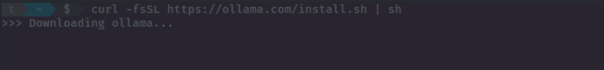
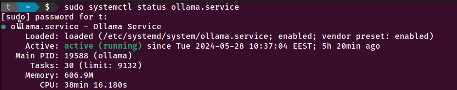
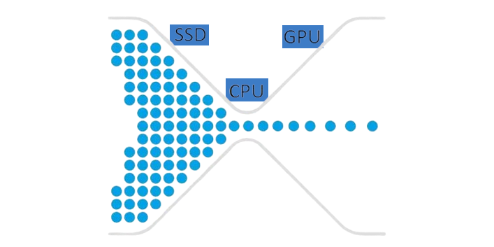
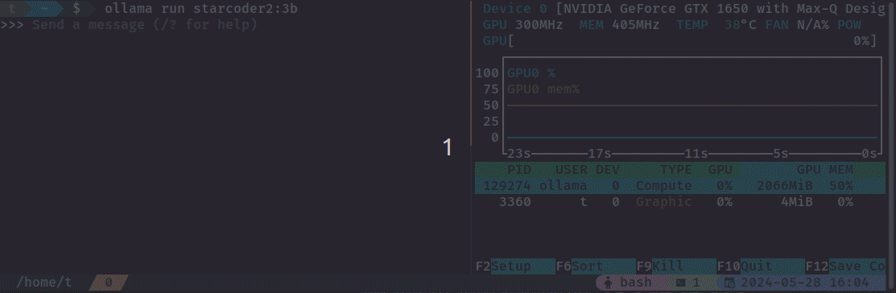
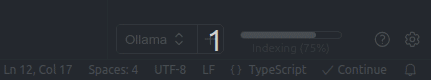
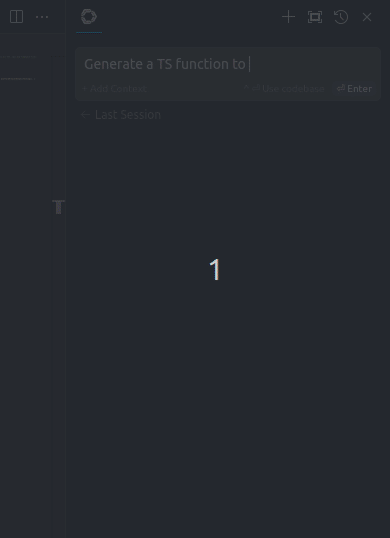
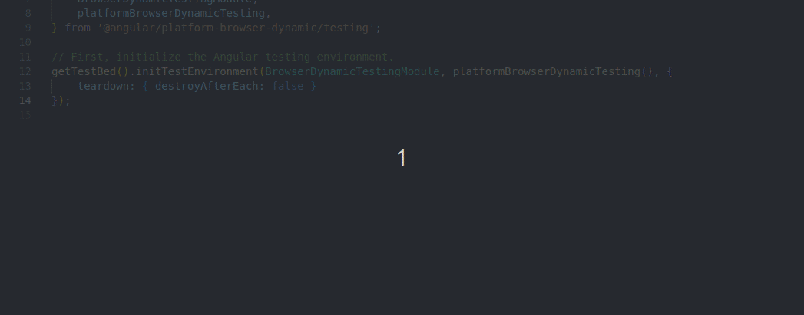

يمكنك توفير ثمن اشتراك [OpenAI](https://openai.com/api/pricing/) او [CoPilot](https://github.com/features/copilot#pricing) أو منافسيهم للحصول على مساعد ذكي مدمج في بيئة تطوير VSCode.
وذلك بتشغيل أحد النماذج اللغوية الكبيرة [LLM](https://en.wikipedia.org/wiki/Large_language_model) محليا على جهازك وربطه مباشرة ببيئة التطوير

## متطلبات الجهاز
 - وحدة معالجة رسوم من شركة نفيديا، أو آبل، ويفضل وجود ذاكرة داخلية 8 جيجابايت فأكثر. أقل ذاكرة 4 جيجا
 - لو لم تتوفر وحدة معالجة الرسوم، سيقوم المحرك باستخدام المعالج العام، وسيعطي نفس النتائج لكن بسرعة أقل كثيرا لدرجة الملل وعدم العملية
 - يتطلب مساحة تخزين حوالي 500 ميجا للبرنامج + النموذج الذي سيتم اخياره لاحقا

 يمكن أن يكون جهازك عبارة عن لابتوب ، لا مشكلة في ذلك عدا الحرارة الزائدة

## متطلبات نظام التشغيل
 - لينوكس أو ماك
 - دعم تجريبي للويندوز 

 تم تجربتي على نظام Ubuntu 22.04

## خطوات التشغيل
 - ادخل على [Ollama](https://ollama.com/download) وقم بتنزيل المحرك حسب الخطوات
 

 - تأكد من حالة الخدمة عن طريق `sudo systemctl status ollama.service`
 

 - أختر النموذج المراد من [Ollama Library](https://ollama.com/library) مع مراعاة الاتي
    - اختيار نموذج حجمه أقل بقليل من حجم ذاكرة وحدة معالجة الرسوم. لو اخترت نموذج أكبر سيقوم المحرك بتحميل جزء منه في الذاكرة العشوائية أيضا مما يؤدي لبطئ شديد. قد جربت ذلك فعلا! لاحظ أن اغلب النماذج به عدة أحجام، تبدأ عادة من 7B، يعني 7 مليار وزن لذلك ننصح بذاكرة 8 جيجابايت.
    
    

    - التركيز على الغرض من النموذج، لا تأتي بنموذج عام يمكنه تأليف الشعر واقامة حوارات لغوية معقدة وكل المطلوب هو تصحيح وشرح أكواد فقط. الأفضل هو التخصص لاعطاء نتائج افضل وسرعة أكبر
 - قد جربت عدة نماذج، أظن افضلهم `starcoder2:3b` لذاكرة 4 جيجا ، ونموذج `codellama:7b` لذاكرة 8 جيجا.
 - نزل النموذج عن طريق `ollama pull starcoder2:3b` كمثال
 - شغل النموذج محليا `ollama run startcoder2:3b`
 - يمكنك الان تجربته من خلال واجهة الاوامر
 - للتأكد من تحميله في وحدة الرسوم بشكل صحيح، يمكنك استخدام الاوامر `nvtop` أو `nvidia-smi`
 

 - قم بتحميل الامتداد التالي لبيئة VSCode للتطوير: [Continue](https://docs.continue.dev/quickstart)
 - افتح ملف الاعدادات الخاصة بالامتداد `~/.continue/config.json` وتأكد أن النموذج الوحيد المتاح هو
 
 ```json
 "models": [
    {
      "title": "Ollama",
      "provider": "ollama",
      "model": "starcoder2-3b"
    }
  ]
```
## التجربة خير دليل
- مع اعادة فتح VSCode سيتم التواصل مع Ollama لتشغيل النموذج بشكل تلقائي
- كما سيتم عمل فهرسة لملفات المشروع المفتوح، وهو محل السؤال والتفاهم. يجب عليك الانتظار حتى تتم الفهرسة
 

- بعدها يمكنك اجراء اوامر مباشرة كطلب كتابة كود

 

- أو سيقوم النموذج بمحاولة مساعدتك أثناء الكتابة بفهم واستكمال ما تكتب من كود

 

- وأخيرا يمكنك أيضا تعليم (Highlight) جزء من الكود لديك ثم عمل طلب خاص `Ctrl+Shift+I`، لتعديل بعض خواصه أو شرحه أو وضع نعليقات ، .. الخ

دمتم في عافية وتطوير :-)