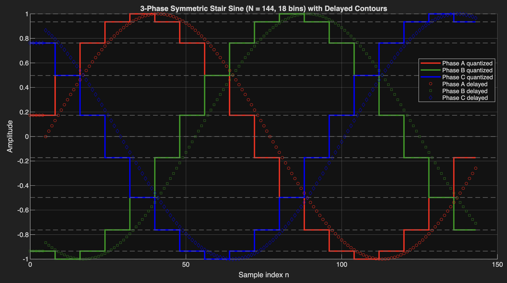

In many power-electronics and signal-processing applications, we need a quantized staircase approximation of a sine wave—one that remains smooth, symmetric, and perfectly aligned across three phases. This is especially useful when modeling digital PWM systems, lookup-table-based control, or simplified capacitor behavior in rectifiers and inverters.

This post walks through a MATLAB implementation that produces:
	•	A symmetric, smooth staircase sine wave
	•	Three phases shifted by exactly 120°
	•	Perfect stair-edge alignment across all phases
	•	Delayed contour sine waves that mimic a capacitor-like response

*Why 18 Bins?*

To preserve symmetry (a b c d 1 d c b a ...) and still maintain perfect 3-phase timing, both the number of samples per period and the number of bins must be chosen carefully.

Using 144 samples per cycle and 18 bins gives:
	•	8 samples per bin
	•	9 bins for the positive half, 9 for the negative half
	•	A 120° shift equal to 6 full bins, which preserves perfectly aligned stair edges

The result is visually smooth and mathematically exact for a 3-phase system.
  
PS: I used the [free online Matlab](https://matlab.mathworks.com/)


